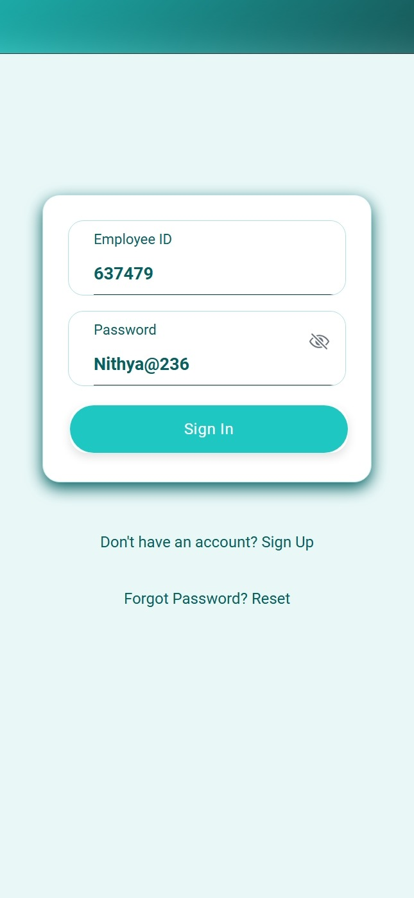
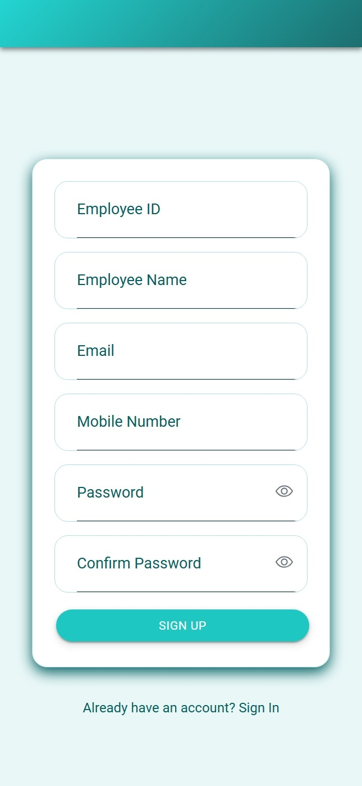
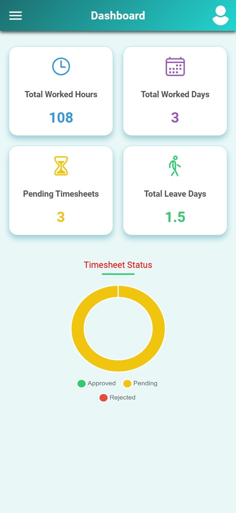
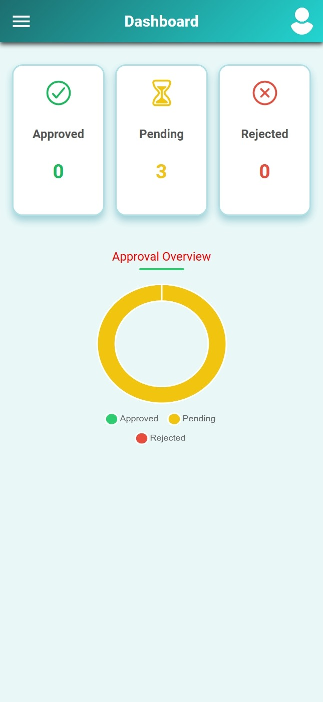
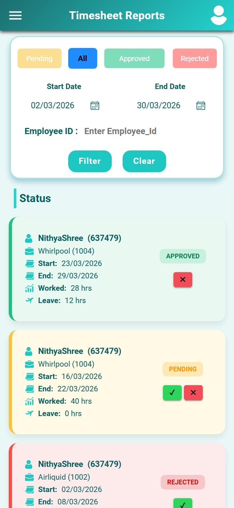
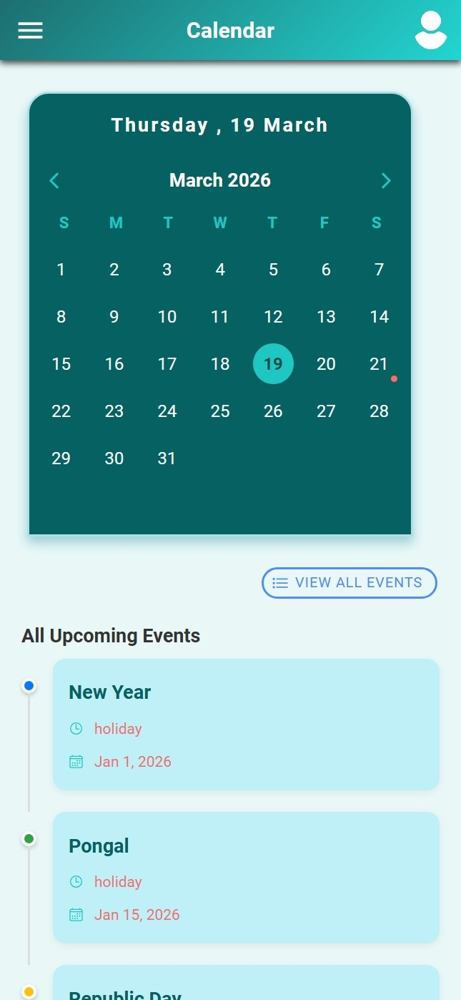

# 🕒 WorkTrack – Timesheet Management System

**Track Work. Stay Productive.**

WorkTrack is a full-stack Timesheet Management Application built using **Ionic + Angular (Frontend)** and **Node.js + Express + MySQL (Backend)**.

It allows employees to log weekly work hours, manage leave, view reports, and track productivity — while admins can manage holidays and approve/reject timesheets.

---

## ✨ Features

### 👤 Employee Features

* 🔐 Secure Login & Signup
* 🔁 Forgot Password with OTP (Email)
* 📝 Weekly Timesheet Entry (Mon–Sun)
* 📅 Calendar View with Holidays
* 📊 Personal Dashboard (Work Summary)
* 🧾 View & Edit Timesheet Reports

### 🛠️ Admin Features

* 📊 Admin Dashboard Overview
* ✅ Approve / Reject Timesheets
* 📅 Manage Holidays (Add/Edit/Delete)
* 📈 Monitor Employee Activity & Reports

---

## 🛠️ Tech Stack

### Frontend

* Ionic Framework
* Angular
* TypeScript
* Chart.js

### Backend

* Node.js
* Express.js
* MySQL
* bcrypt
* nodemailer
* dotenv

---

## 📁 Project Structure

```
timesheet_project/
├── timesheet_frontend/
├── timesheet_backend/
├── screenshots/
├── README.md
```

---

## ⚙️ Installation

### 1️⃣ Clone Repository

```bash
git clone https://github.com/your-username/worktrack.git
cd worktrack
```

---

### 2️⃣ Backend Setup

```bash
cd timesheet_backend
npm install
npm start
```

---

### 3️⃣ Frontend Setup

```bash
cd timesheet_frontend
npm install
ionic serve
```

---

## 🔐 Environment Variables

Create a `.env` file inside `timesheet_backend`:

```
PORT=2025

DB_HOST=localhost
DB_PORT=3306
DB_USER=your_db_user
DB_PASSWORD=your_db_password
DB_NAME=timesheet

EMAIL_USER=your_email
EMAIL_PASS=your_app_password
```

---

## ▶️ How to Run

1. Start MySQL
2. Run backend → `npm start`
3. Run frontend → `ionic serve`
4. Open browser and use the app

---

## 📸 Screenshots

### 🏠 Home Page


### 🔐 Login Page



### 📝 Register Page



### 👤 User Dashboard



### 🛠️ Admin Dashboard



### 📊 Report Page



### 📅 Calendar Page



---

## 🌐 API Endpoints (Summary)

### Auth

* POST `/api/user/signup`
* POST `/api/user/login`
* POST `/api/user/forgot-password`
* POST `/api/user/verify-otp`
* POST `/api/user/reset-password`

### Timesheet

* POST `/api/project/timesheetsubmit`
* PUT `/api/project/updateTimesheet`
* GET `/api/project/getEmployeeDetails`

### Admin

* GET `/api/project/admin/reports`
* PUT `/api/project/admin/updateWeeklyStatus`

---
## 🔐 Security

- Environment variables used for sensitive data  
- Passwords are hashed using bcrypt  
- OTP-based password reset implemented

---

## 🚀 Future Improvements

* JWT Authentication
* Notifications
* Advanced Analytics
* UI Enhancements

---

## ⚠️ Disclaimer

This project is a personal/demo version inspired by a real-world timesheet system.  
All company-specific data, branding, and sensitive information have been removed.
---

## 👩‍💻 Author

**Nithya Shree**

---
## 🌐 Live Demo
Coming soon...

---

## 🔐 Security Note

* Do NOT upload `.env`
* Keep DB & email credentials safe
---

## 📄 License

This project is for learning and portfolio purposes.
